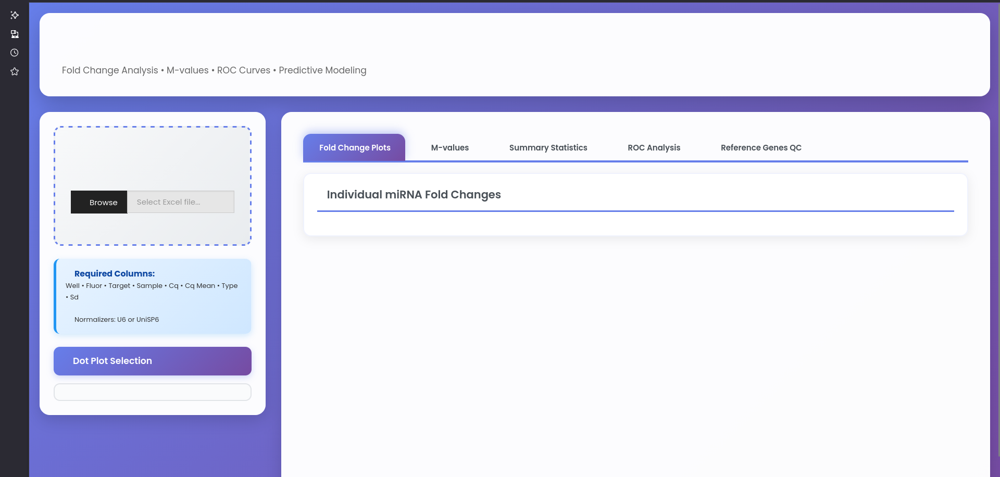

# miRNA RCC Diagnostic Platform

**R Shiny web application for miRNA expression analysis in renal cell carcinoma**

🔗 **[Live app → markbarsoummarkarian.shinyapps.io/mirna-qpcr-platform](https://markbarsoummarkarian.shinyapps.io/mirna-qpcr-platform/)**

---

> You have qRT-PCR Cq data from kidney tumor and normal tissue. You want to know which miRNAs are dysregulated, how reliable your normalization is, and whether a panel of miRNAs can discriminate tumor from normal. This tool does all of that — in a browser, with no command line.

---

## What it does

Upload a standard qPCR export file. The platform runs a complete analysis:

| Step | Method | Output |
|---|---|---|
| Normalization | ΔCt to reference genes (U6, UniSP6) | Per-sample normalized expression |
| Fold change | 2^(−ΔΔCt) vs normal calibrator | Per-miRNA FC with direction |
| Reference stability | geNorm M-value algorithm | Stability rankings, CV, mean Ct |
| Statistical testing | Wilcoxon rank-sum | p-values with significance annotation |
| Diagnostic performance | ROC-AUC per miRNA | Individual discriminatory power |
| Multi-miRNA classifier | Elastic net logistic regression (α=0.5) | Combined panel AUC + feature selection |

## Why these methods

**geNorm over simple ΔCt:** Reference gene stability varies. geNorm identifies which reference genes are actually stable before using them for normalization.

**Wilcoxon over t-test:** qPCR fold change data is rarely normally distributed, and clinical cohort sizes are small. Wilcoxon is robust to both.

**Elastic net over plain logistic regression:** When miRNA count approaches or exceeds sample count, elastic net prevents overfitting and performs automatic feature selection. Surviving non-zero coefficients = your candidate diagnostic panel.

---

## Input format

CSV or Excel with these columns:

| Column | Description |
|---|---|
| Well | Well position |
| Target | miRNA or reference gene name |
| Sample | Sample identifier |
| Cq / Ct | Quantification cycle value |
| Cq Mean | Mean Cq across technical replicates |
| Type | Normal or Tumor |
| Sd | Standard deviation of Cq |

Reference genes recognized: **U6**, **UniSP6**

---

## How to run

### Option A — Use the live app (no installation)
👉 [markbarsoummarkarian.shinyapps.io/mirna-qpcr-platform](https://markbarsoummarkarian.shinyapps.io/mirna-qpcr-platform/)

### Option B — Run locally

---

## Output

- Fold change boxplots with significance annotations
- Per-miRNA ROC curves + combined elastic net panel ROC
- geNorm reference stability QC plots and rankings
- Downloadable Excel report (FC, p-values, AUC, geNorm M-values, model coefficients)

---

## Stack

R · Shiny · shinyapps.io · ggplot2 · plotly · glmnet · pROC

**License:** MIT
